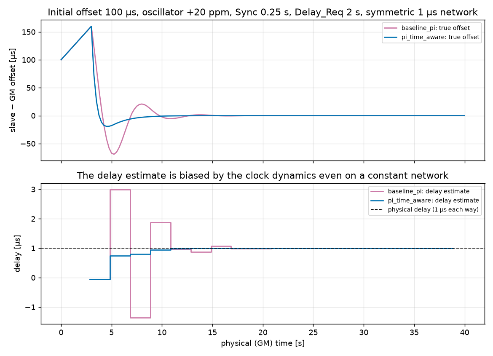
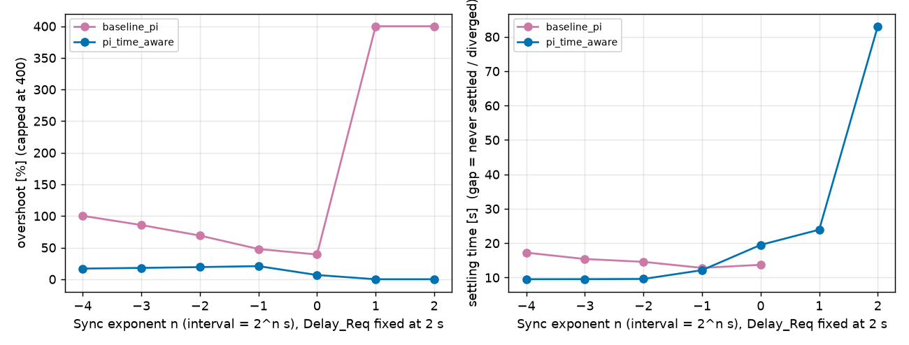

# PTP_sim — closed-loop simulator of a Zephyr PTPv2 time receiver

Interactive, discrete-event simulator of the **complete synchronisation loop** of a Zephyr PTPv2 time
receiver: disciplined clock, hardware timestamps, Sync/Follow_Up/Delay_Req/Delay_Resp exchange, delay
and offset estimation, the PI servo and the rate actuator (ideal, or the NXP ENET 1588 timer as modified
by Zephyr PR #121108). It was built to study and improve the controller that makes the slave follow the
Grandmaster.

* The baseline is a **behavioural port of the firmware** (`subsys/net/lib/ptp/{clock,port}.c`,
  `subsys/precision_timing/precision_pi.c`), not a generic PTP model. Its arithmetic is compared bit-for-bit
  with the real C code (see [Validation](#validation)).
* `t2`/`t3` are read from the **same disciplined clock whose rate the servo changes**, so the delay estimate
  suffers from the clock dynamics exactly as in the firmware.
* The controller only sees what the firmware sees; the simulator's ground truth is used for plots and
  metrics only.

> **Not validated on hardware.** No real debug logs were available (see
> [docs/firmware_reconstruction.md](docs/firmware_reconstruction.md)); everything below that says "the model
> predicts" is a prediction of the simulator, verified against the firmware *code*, not against measurements.

## Install and run

```bash
python3 -m venv .venv && . .venv/bin/activate
pip install -e '.[gui,test]'          # numpy; GUI: PySide6 + pyqtgraph; tests: pytest
ptpsim-gui                            # interactive GUI   (or: python -m ptpsim.gui.app [scenario.json])
ptpsim-run run --config configs/default_deterministic.json --out results/run   # headless + CSV
ptpsim-run run --preset noisy --set intervals.sync_log=-3 --set seed=5 --out results/run_noisy
ptpsim-run compare --out results      # baseline vs variant, writes results/comparison.{csv,md}
pytest                                # 106 tests (the C-reference tests need gcc, the GUI tests Qt)
python bench/benchmark.py             # engine benchmark   (bench/gui_latency.py: GUI reactivity)
```

Python ≥ 3.10 (developed on 3.14). Dependencies: `numpy` (engine); `PySide6`, `pyqtgraph` (GUI); `matplotlib`
only for `scripts/make_figures.py` (`pip install '.[docs]'`).
Headless GUI check: `QT_QPA_PLATFORM=offscreen python bench/gui_latency.py`.

## Repository layout

| Path | Content |
|---|---|
| `ptpsim/engine.py` | discrete-event engine: GM, network, slave firmware model, slave clock, results |
| `ptpsim/fwport.py` | bit-faithful ports of the PI, ppb→scaled-ppm→ratio, NXP `find_correction`, ENET timer model |
| `ptpsim/controllers.py` | controller interface, **baseline_pi** (firmware PI), **pi_time_aware** (variant) |
| `ptpsim/actuators.py`, `clock.py` | ideal / NXP actuators; piecewise-linear slave clock |
| `ptpsim/rng.py` | disturbance streams indexed by message sequence number (reproducible seeds) |
| `ptpsim/metrics.py`, `export.py`, `compare.py`, `analysis.py`, `cli.py` | metrics, CSV/JSON export, comparison, analytic loop model, CLI |
| `ptpsim/gui/`, `ptpsim/live.py` | GUI (separate worker *process*), incremental live session |
| `tests/` | unit/integration tests; `tests/c_ref/` vendored Zephyr C sources compiled by the tests |
| `configs/` | scenario files (`scripts/make_configs.py`); `results/` committed baseline-vs-variant results |
| `bench/` | benchmarks and their recorded results |
| `docs/firmware_reconstruction.md` | **phase 1**: verified reconstruction of the firmware loop, with file/function/commit |
| `docs/model.md` | model, jitter analysis, approximations, NXP table, validation matrix |

## What is modelled

Events (all with integer-picosecond physical time, deterministic order at equal times: priority, then FIFO):
Sync TX/RX, Follow_Up TX/RX, Delay_Req TX/RX, Delay_Resp TX/RX, hardware timestamp acquisition, software
processing, command application, oscillator updates. Highlights (details in [docs/model.md](docs/model.md)):

* GM clock = physical time, constant rate. Slave: configurable initial offset, oscillator error, optional
  drift/random walk; phase is continuous across rate changes; steps only from the firmware's own `clock_step`.
* `t1`,`t4` GM domain; `t2`,`t3` slave clock evaluated at the physical instant of the event, **before** the
  Follow_Up/Delay_Resp is received. Sync/Follow_Up pairing slot, Delay_Req list, "latest t1/t2" delay estimate,
  `mean_delay == 0` servo skip, 1 s step, lock / outlier / reset logic and the stale-Delay_Resp-after-step quirk
  are reproduced as found in the code.
* PI: `integral += ki*e; ppb = kp*e + integral`, `e = -offset[ns]`, **absolute** output, no dt; ppb→scaled ppm
  (truncation)→rate ratio; out-of-window requests are rejected by the driver and trigger `clock_servo_reset()`.
* Delay_Req timing: first request uniform in (0, 2·2ⁿ] s, then period 2ⁿ s from a **monotonic, undisciplined timer**
  (`k_timer`) with its own configurable rate error. The firmware has no "every N Sync" mode: it is provided as an
  explicitly labelled non-firmware option.
* Intervals are `1 s × 2ⁿ`, `n ∈ [-4, 2]` in the GUI (a UI range, **not** a protocol limit: the firmware accepts
  `logMessageInterval` in `[-10, 22]`).

### Jitter model (answer to "is jitter on the send instant the right model?")

With hardware timestamps, jitter of the **send instant** adds *no* error to `t1..t4`; it only makes sampling
irregular (and shifts when Follow_Up/Delay_Resp/commands are processed). What corrupts measurements is
**path-delay variation**, **timestamp noise/quantisation** and, indirectly, the clock motion between `t2` and `t3`.
So the simulator keeps them as separate, independently configurable sources: send-instant jitter for **all four**
message types (default shape: truncated normal, non-cumulative around the nominal grid, as seen in the traces),
per-direction path jitter (one-sided exponential), software latencies (Follow_Up, Delay_Resp, RX processing,
command application, TX-timestamp callback), GM/slave timestamp noise and quantisation, message loss. Each source
has its own PRNG stream indexed by message sequence number: **changing the controller never changes the noise**.

## Results

`ptpsim-run compare` (committed in [`results/comparison.md`](results/comparison.md); 300 s, initial offset 100 µs,
oscillator +20 ppm, ideal actuator unless stated, noisy rows: 10 seeds). The servo only starts after the first
valid delay sample (≈ 3 s: the first Delay_Req is sent at a random time in (0, 2·2ⁿ] s), so the offset has already
grown to ≈ 160 µs when the **first PI command** is issued; **overshoot is measured against that value** (it is the
same for both controllers), *undershoot* is the opposite-side excursion in µs, settling is counted from t = 0.
The variant `pi_time_aware` (law and units in `ptpsim/controllers.py`) is compared **only** on the numbers below.

| scenario | controller | settling (±1 µs, 10 s) | overshoot | undershoot | RMS offset (final 60 s) |
|---|---|---|---|---|---|
| deterministic, Sync 0.25 s | baseline_pi | 14.6 s | 43 % | 69 µs | 0.7 ns |
| deterministic, Sync 0.25 s | pi_time_aware | **9.6 s** | **12 %** | **19 µs** | 0.6 ns |
| noisy (±2 µs band, 10 seeds) | baseline_pi | 11.6 ± 1.7 s | 43 ± 1 % | 61 µs | 222 ± 32 ns |
| noisy (±2 µs band, 10 seeds) | pi_time_aware | **7.3 ± 1.2 s** | **11 ± 2 %** | **15 µs** | 211 ± 26 ns |

Across Sync intervals (Delay_Req 2 s, deterministic): the variant has 4–13 % overshoot and is faster up to
Sync 0.25 s (9.5–9.6 s vs 14.6–17.3 s); at **Sync 0.5 s it is on par** (12.2 vs 12.8 s) and at **1 s it is slower**
(19.5 vs 13.7 s, with 4 % vs 25 % overshoot) because its bandwidth is capped for stability (`wn·dt ≤ 0.35`).
At Sync ≥ 2 s the baseline diverges in the model while the variant settles in 24–83 s. The noisy-scenario RMS
is set by the path jitter and is essentially the same for both. See the full tables for Delay_Req sweeps,
actuators and message loss: with 5 % loss the variant still settles faster (9.3 vs 14.1 s), but with **20 % loss it is
worse** (RMS 427 vs 307 ns, 280 s vs 16 s settling) — it is not claimed better there.




Findings (model predictions, with the evidence in the tests/results):

1. **The baseline's loop shape depends on the Sync interval.** `ki` acts per sample, so the continuous-time
   integral gain is `ki/T`: the continuous-approximation damping `ζ = kp / (2·sqrt(ki/T))` is 0.64 at T = 1 s (the
   interval the Kconfig help says it is tuned for) but 0.32 at T = 0.25 s, and the overshoot grows as the Sync interval
   shrinks (25 % at 1 s → 64 % at 62.5 ms in the sweep). `tests/test_engine.py::test_matches_discrete_closed_loop_recursion_exactly`
   checks the simulated loop against its analytic recursion to 1e-3 ns.
2. **The delay estimate is biased by the servo itself.** `delay = ((t2−t3)+(t4−t1))/2` pairs the latest Sync's `t2`
   with a later `t3`: error = (offset(t2) − offset(t3))/2 even on a constant, symmetric network (figure above:
   up to ±2 µs on a 1 µs delay during the transient).
3. **At Sync ≥ 2 s the baseline diverges in the model** (Delay_Req 2 s): the ideal loop's poles are stable, but with the
   firmware's delay estimator the loop is not (`test_baseline_instability_at_long_sync_comes_from_delay_estimate_coupling`:
   stable with exact delay, resets forever with the estimated one). A hypothesis to check on hardware.
4. **Large initial offsets:** the PI is not clamped, so an offset above ≈ 71 ms asks for > 50 000 ppm and the NXP
   driver rejects it → `clock_servo_reset()` loop (the 100 ms outlier rule only applies after lock).
5. **24 MHz clock root (INC = 41):** the reachable average rates near ratio 1.0 are ≈ 63 ppm apart (table in
   [docs/model.md](docs/model.md)), so any oscillator error is realised by dithering between the nominal pair and a
   neighbour 63 ppm away. In the model the median |offset| at 24 MHz exceeds the 236 ns reported on hardware in the
   commit message of PR #121108 as soon as the relative frequency error is above ≈ 0.002 ppm, while 98.304 / 100 /
   196.608 MHz give ≈ 155 ns whatever the error ([`results/nxp_root_sweep.md`](results/nxp_root_sweep.md),
   noisy preset). Either the boards shared a frequency reference in that measurement, or the simulator's model of the
   correction counter near nominal is incomplete — **this needs the real conditions to be settled** (see questions below).

## GUI

Two grafici sharing the time axis (**Delay**: firmware estimate held between samples, with sample markers, and the
physical delay reference; **Offset**: estimated, real, optional baseline overlay), units ns/µs/ms, zoom/pan,
legends, diagnostic rate panel, metrics table. Controls (spin + slider): Kp/Ki (or the variant's parameters),
controller selection, Sync and Delay_Req exponents (with the resulting interval shown), independent / every-N mode,
initial offset and frequency error, duration, seed, network delay/asymmetry/jitter, latencies, timestamp noise,
loss, actuator and clock root.

* **Esplorazione:** any change recomputes the whole trajectory from the same initial conditions and seed.
* **Live:** the trajectory continues; new parameters apply from the current instant (dashed marker on the plots);
  explicit integrator policy on gain changes (*keep / reset / bumpless*), start/pause/reset and playback speed
  (the speed only changes how much simulated time is requested per tick, never the maths).
* Simulations run in a **worker process** (the engine is pure Python: a thread would fight the GUI for the GIL),
  with 40 ms debounce, cooperative cancellation between 20 s chunks, results of superseded requests discarded,
  widgets updated only in the GUI thread, bounded live buffers, rendering down-sampling only
  (`pyqtgraph` peak-mode) — metrics use the full data.
* Measured reactivity (offscreen Qt, software rendering, 300 s scenario, **from the parameter change to the end of the
  repaint**, 40 trials): default deterministic **median 124 ms, p95 144 ms**; NXP actuator 171 / 179 ms; baseline overlay
  171 / 189 ms ([`bench/results_gui_*.json`](bench)). The engine alone takes 29 ms (ideal) / 76 ms (NXP) for 300 s
  ([`bench/results_engine.json`](bench/results_engine.json)); no JIT was needed. The *calculation* never blocks the GUI
  (separate process), but each redraw occupies the GUI thread for ≈ 80 ms (p99 of a 5 ms heartbeat gap, mostly pyqtgraph
  axis/grid painting). A real display may differ from the offscreen figures.

## Metrics (definitions)

Computed separately for the **true** and the **estimated** offset, on full-resolution data (`ptpsim/metrics.py`):
settling time (configurable band and dwell; `–` with reason if never settled), overshoot (opposite-side excursion
over |x0|; undefined for x0 = 0), peak |error| (exact for the true offset, from the piecewise-linear vertices),
RMS and bias on a configurable final window, saturation/reset counters, divergence flag, compute time.

## Validation

| Item | How | Status |
|---|---|---|
| PI, ppb→scaled ppm, NXP `find_correction` vs C | `tests/test_c_reference.py`: vendored Zephyr C sources compiled with gcc and compared through ctypes (exact equality, random inputs, edge cases) | ✔ verified |
| PR #121108 ztest cases (ATCOR = period−1, closer neighbour, sweeps) | ported in the same file | ✔ verified |
| Closed loop = analytic recursion | exact-delay run vs recursion, < 1e-3 ns | ✔ verified |
| Identical clocks, offset only, frequency error, phase continuity, t2/t3 before FUP/Resp, pairing, rate change between t2 and t3, ordering, asymmetry bias, saturation/anti-windup, interval changes, 1e6 s precision, jitter distribution/seeds | `tests/test_engine.py`, `tests/test_units.py` | ✔ verified |
| Baseline vs **hardware** | no real logs available | ✘ **not validated** |
| Log importer / replay | needs the real instrumentation format (not in any branch) | ✘ not implemented |

*Replay vs counterfactual:* re-playing timestamps captured with an old controller validates estimators but
is **not** a simulation of a new controller, because `t2`/`t3` depend on the disciplined clock; the simulator is
closed-loop (counterfactual) by construction. A future replay importer would be a validation tool only.

## Approximations and known limitations

* NXP timer: **average-rate model**. The real counter adds `INC` per tick and `INC_CORR` once every `ATCOR+1` ticks,
  so timestamps carry a deterministic step pattern (pk-pk `INC_CORR−INC` ns: 54 ns at 98.304 MHz, 27 ns at 196.608 MHz,
  2 ns at 24 MHz, none at 100 MHz) that is **not** reproduced; use the timestamp-noise parameter (σ ≈ pk-pk/√12) to
  emulate it. The phase of the correction counter at register writes is undocumented. Timestamps are floored to the
  nominal tick. Details in `docs/model.md`.
* Not simulated: BMCA/announce/state machine (the slave starts in TIME_RECEIVER; a Sync-receipt timeout does not
  change state), one-step Sync, P2P delay, `ingress` fallback guard (5 s), TLVs, multiple ports, transparent clocks
  beyond a constant `correctionField`.
* Software latencies are constant + jitter; no queueing/priority model of the PTP thread. The oscillator drift is
  applied in steps (default 1 s).
* The GM "send jitter" is non-cumulative around a nominal grid (as in the traces). A Zephyr GM would re-arm its
  timer at handling time (cumulative); the Delay_Req equivalent is available (`delay_rearm_from_handling`).
* Baseline numbers depend on the unknown real board setup (clock root, GM, network); defaults are placeholders.

## License

Apache-2.0 (see `LICENSE`); the vendored Zephyr sources in `tests/c_ref/` keep their original SPDX headers.
