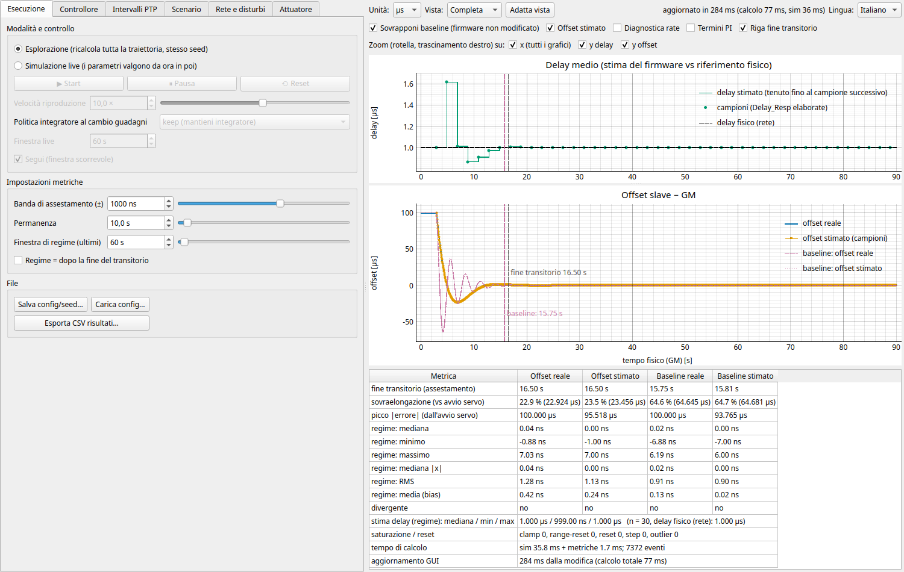
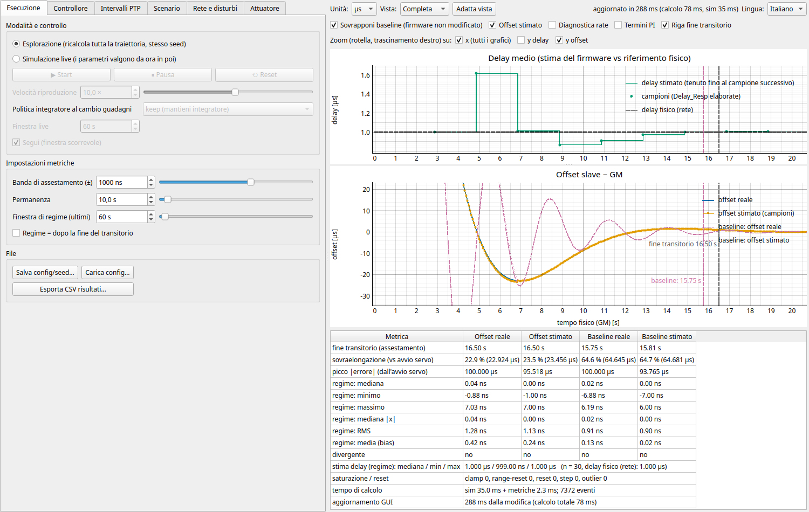
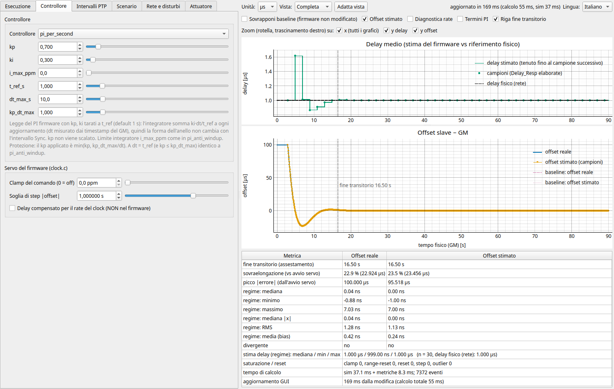
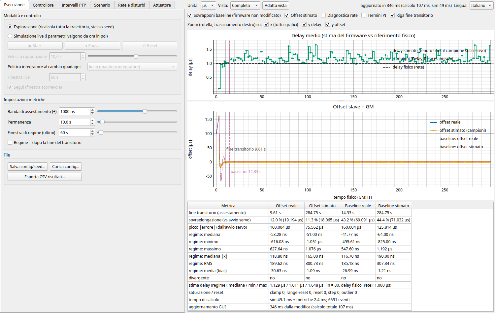
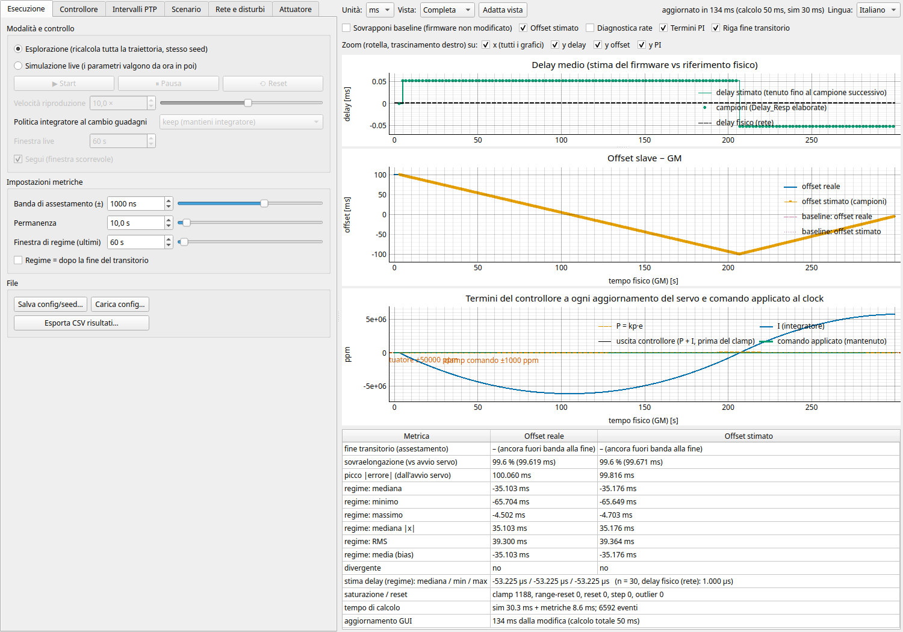
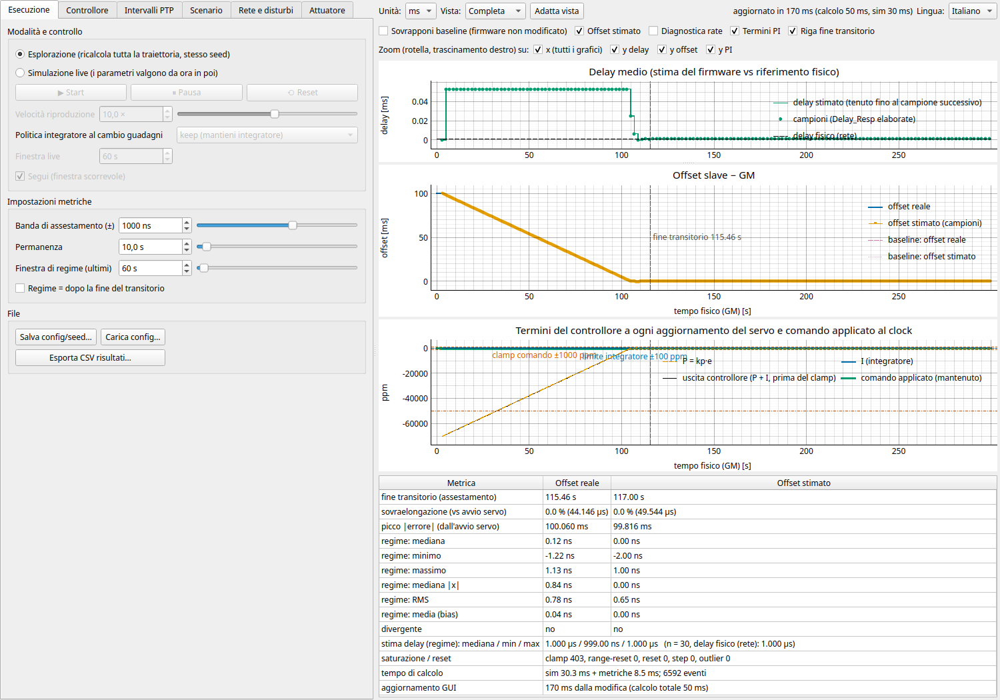
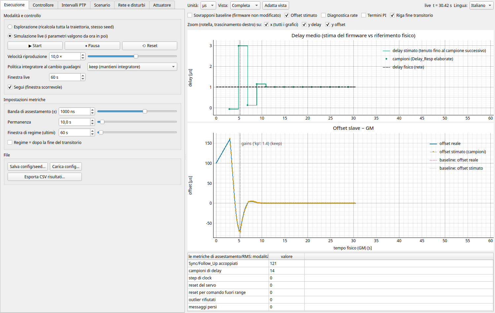

# Manuale d'uso di PTP_sim (italiano)

Versione inglese: [manual.en.md](manual.en.md). Modello e background del firmware: [model.md](model.md),
[firmware_reconstruction.md](firmware_reconstruction.md).

## 1. Cosa stai guardando

PTP_sim simula un **time receiver (slave)** PTPv2 agganciato a un **Grandmaster (GM)**. Il clock del GM è il
riferimento: ha rate costante e *il tempo fisico di simulazione coincide con il tempo del GM*. Lo slave ha un proprio
clock (il PHC) di cui un servo (un controllore PI) modifica il **rate**; la fase non viene mai spostata, tranne dal
riallineamento forzato del firmware stesso (vedi *Offset iniziale*).

Si scambiano quattro messaggi: **Sync** e **Follow_Up** (GM → slave, ogni intervallo Sync), **Delay_Req** (slave → GM) e
**Delay_Resp** (GM → slave, ogni intervallo Delay_Req). Ne derivano quattro timestamp:

| | significato | clock |
|---|---|---|
| `t1` | istante di trasmissione del Sync al GM (portato dal Follow_Up) | GM |
| `t2` | istante di ricezione del Sync allo slave | **slave (disciplinato)** |
| `t3` | istante di trasmissione del Delay_Req dallo slave | **slave (disciplinato)** |
| `t4` | istante di ricezione del Delay_Req al GM (portato dal Delay_Resp) | GM |

Il firmware stima `delay = ((t2−t3)+(t4−t1))/2` e `offset = (t2−t1) − delay` (positivo = slave in anticipo).
Poiché `t2` e `t3` provengono da un clock il cui rate è modificato dal servo, le stime risentono del controllo stesso:
è il motivo per cui si simula l'anello chiuso.

**Tieni sempre distinte due grandezze:**

* **Offset reale** (blu): slave − GM nello stesso istante *fisico*. Lo conosce solo il simulatore.
* **Offset stimato** (punti arancio): ciò che il firmware calcola dai timestamp e dà al PI. Esiste solo ai campioni Sync e può
  differire dal reale (delay vecchio, asimmetria, rumore, moto del clock tra `t2` e `t3`).

Il controllore non vede mai i valori reali.

## 2. La finestra

```
┌ schede (parametri) ┐ ┌ barra: unità, vista, adatta, stato, lingua ────────────────────────────────────────────────┐
│ Esecuzione         │ │ mostra: sovrapposizione, stimato, diagnostica, termini PI, riga transitorio                │
│ Controllore        │ │ grafico 1: Delay                                                                           │
│ Intervalli PTP     │ │ grafico 2: Offset   (tutti condividono l'asse tempo; zoom/pan con rotella e trascinamento) │
│ Scenario           │ │ grafico 3 (opzionale): Diagnostica rate                                                    │
│ Rete e disturbi    │ │ grafico 4 (opzionale): Termini PI (P, I, uscita controllore, comando applicato)            │
│ Attuatore          │ │ tabella delle metriche (sempre visibile per intero)                                        │
└────────────────────┘ └────────────────────────────────────────────────────────────────────────────────────────────┘
```


*Scheda Esecuzione, modalità esplorazione. `pi_per_second` (linea piena) contro la baseline del firmware non modificato (tratteggiata, "Sovrapponi baseline") su rete quieta: Sync 62,5 ms (n = −4), offset iniziale 100 µs, 90 s. L'undershoot dell'offset reale è 22,9 µs contro 64,6 µs della baseline; il transitorio finisce a 16,5 s contro 15,75 s. Le righe di regime coprono gli ultimi 60 s, dopo il transitorio. Si rigenera con `scripts/make_gui_figures.py`.*

**Lingua** (in alto a destra): English (predefinita) o Italiano. Il cambio ricostruisce la finestra nella nuova lingua
mantenendo la configurazione (una sessione live in corso viene riavviata). La scelta viene ricordata.

**Grafici.** Rotella = zoom, trascinamento = pan, tasto destro = menu pyqtgraph, "A" nell'angolo = auto-range.
La riga **Zoom** sopra i grafici sceglie su quali assi agisce lo zoom (rotella, trascinamento col tasto destro): **x** è un
unico interruttore per tutti i grafici (condividono l'asse del tempo), **y** ha un interruttore per grafico (i grafici rate e PI
compaiono quando sono visibili). Gli assi non selezionati mantengono il loro intervallo durante lo zoom, ma il trascinamento
(pan) non è mai limitato. Con y non selezionato il grafico si riscala comunque sui dati visibili nell'intervallo x ingrandito,
come con "Adatta vista"; lo zoom su y di un grafico selezionato spegne l'auto-range di quell'asse finché non premi "Adatta vista".


*La stessa simulazione dopo quattro scatti di rotella sul grafico dell'offset (**y offset** selezionato) e uno su quello del delay (**y delay** deselezionato): l'asse del tempo è ingrandito in entrambi i grafici (≈ 1–20 s); solo la y dell'offset è ingrandita (da −30 a 20 µs), quella del delay no: si riscala soltanto sui dati visibili nell'intervallo di tempo ingrandito.*

* *Grafico Delay*: la stima del delay del firmware (verde) è **tenuta** fino all'elaborazione della Delay_Resp successiva, con un
  punto a ogni campione (così si vede la frequenza reale dei campioni); la linea nera tratteggiata è il delay fisico della rete.
* *Grafico Offset*: offset reale (blu), stimato (arancio), opzionalmente la baseline (rosa, tratteggiata) per confronto:
  il **firmware non modificato** (PI baseline 0.7/0.3, costanti di `clock.c`, nessun clamp del comando) sullo stesso scenario e seed.
  Le righe verticali rosse punteggiate indicano step/reset del servo; le righe grigie tratteggiate (live) i cambi di parametro.
* *Diagnostica rate*: i ppb comandati dal servo contro l'errore di rate effettivo del clock rispetto al GM (include
  l'errore dell'oscillatore).
* *Termini PI* (ppm): a ogni aggiornamento del servo il termine proporzionale **P = kp·e**, l'integratore **I** e l'**uscita
  del controllore** (P + I per le leggi PI, prima del clamp del comando); il **comando applicato** al clock (mantenuto, verde)
  mostra il clamp e il ritorno al nominale a ogni reset del servo. Step e outlier rifiutati non aggiornano, quindi nessun punto.
  Le righe orizzontali indicano i limiti attivi: attuatore ±50 000 ppm, clamp del comando, limite dell'integratore
  (`pi_anti_windup`), limite del controllore (`sat_ppb` di `pi_time_aware`); non entrano nell'auto-range dell'asse y. Serve a
  dimensionare un limite anti-windup: quanto cresce I mentre il comando è in clamp, e quale I a regime deve poter ancora tenere.
* **Riga di fine transitorio** (verticale tratteggiata, con etichetta): istante in cui l'offset reale entra nella banda di
  assestamento e vi resta per il tempo di permanenza (§4). Nel grafico Offset la riga della baseline sovrapposta è rosa.
* **Vista**: *Completa* (tutta la corsa), *Transitorio* (da t=0 — o da poco prima dell'avvio del servo dopo un riallineamento
  forzato — a 1.3 × la fine del transitorio), *Regime* (dalla fine del transitorio alla fine). L'asse y si adatta sempre ai dati
  visibili. "Adatta vista" ripristina la corsa intera.
* **Unità** (ns / µs / ms) valgono per i grafici. La tabella delle metriche sceglie da sola l'unità più leggibile.

**Tabella delle metriche** (modalità Esplorazione): vedi §4. Colonne: offset reale, offset stimato e — con la sovrapposizione —
le stesse per la baseline.

## 3. Riferimento dei parametri

Per ogni voce: *cos'è*, *unità/intervallo* e il percorso JSON in una configurazione salvata (§6). Si indica quando il valore
il firmware lo legge da Kconfig/devicetree.

### 3.1 Scheda "Esecuzione"

**Modalità**
* **Esplorazione**: ogni modifica ricalcola *tutta* la traiettoria dalle stesse condizioni iniziali e con lo stesso seed.
  Serve a confrontare tarature.
* **Live**: la traiettoria prosegue nel tempo (simulato); le modifiche valgono **dall'istante corrente**, segnato da una riga
  tratteggiata. Pulsanti **Start / Pausa / Reset**; le modifiche fatte prima di Start riavviano la sessione da t = 0.
* **Velocità di riproduzione** (live): secondi simulati per secondo reale (0.1×–500×). Cambia solo quanto tempo simulato si
  richiede a ogni tick; la matematica della simulazione è identica a qualsiasi velocità.
* **Politica integratore al cambio guadagni** (live): cosa succede allo stato integrale quando cambi i guadagni o il
  controllore: *keep* (lo lascia / ne riporta il valore), *reset* (lo azzera), *bumpless* (lo ricalcola perché l'uscita non faccia
  salti). Nessun reset avviene mai di nascosto.
* **Segui / Finestra live**: tiene l'asse tempo sugli ultimi N secondi.

**Impostazioni metriche** (anche §4)
* **Banda di assestamento (±)** [ns]: il transitorio è finito quando |offset| resta dentro ±banda.
* **Permanenza** [s]: per quanto tempo deve restarci per contare.
* **Finestra di regime (ultimi)** [s]: gli ultimi W secondi usati per le statistiche a regime.
* **Regime = dopo la fine del transitorio**: usa tutto ciò che segue la fine del transitorio invece degli ultimi W secondi.

**File**: *Salva config/seed* scrive il JSON dello scenario (seed compreso); *Carica config* lo ripristina esattamente (valori fuori
dal range di un controllo, o impostazioni per tipo di messaggio, restano finché non modifichi quel controllo); *Esporta CSV*
scrive `params.json`, `metrics.json`, `servo_samples.csv`, `delay_samples.csv`, `true_offset.csv`, `rate.csv`, `events.csv`.
`servo_samples.csv` contiene, per ogni campione del servo, l'uscita del controllore `cmd_ppb`, l'`integral`, l'`action` e —
ultime due colonne — il comando accettato dal driver `cmd_applied_ppb` (dopo il clamp) e il termine proporzionale `p_ppb`.

### 3.2 Scheda "Controllore"


*Scheda Controllore con `pi_per_second`: i guadagni `kp`, `ki` tarati a `t_ref_s` (1 s), il limite dell'integratore e `dt_max_s`, `kp_dt_max`, la descrizione della legge scelta e il gruppo "Servo del firmware".*

**Controllore** — la legge che comanda il rate del clock. Tutti producono una correzione di frequenza **assoluta** in ppb
(positivo = più veloce) usando solo l'**offset stimato**.

* `baseline_pi` — porting del firmware (`precision_pi_update`): `integrale += ki·e; u = kp·e + integrale`, `e = −offset [ns]`.
  * **kp** [ppb/ns]: guadagno proporzionale (default firmware 0.7 = `PRECISION_TIMING_PI_KP` 700/1000).
  * **ki** [ppb/ns per aggiornamento]: guadagno integrale, applicato **a ogni campione, senza dt** (default firmware 0.3).
    Conseguenza: lo smorzamento dell'anello dipende dall'intervallo Sync (l'help Kconfig dice che i default vanno bene per ≈1 s).
  * Nessuna saturazione: un comando oltre ±50 000 ppm viene rifiutato dal driver NXP e il firmware azzera il servo
    (a meno che sia attivo il *clamp del comando* sperimentale qui sotto; l'integratore allora va in windup, non c'è anti-windup).
* `pi_time_aware` — PI sperimentale con tempo esplicito e anti-windup.
  * **wn** [rad/s]: frequenza naturale dell'anello chiuso; `kp = 2ζ·wn` [1/s], `ki = wn²` [1/s²].
  * **zeta** []: smorzamento (1 = criticamente smorzato).
  * **sat_ppb** [ppb]: limite del comando (deve restare sotto 50 000 ppm = 50 000 000 ppb); l'integratore si congela finché l'uscita è
    satura e l'errore la spingerebbe oltre (anti-windup).
  * **wn_ts_max** [rad]: limita la banda a `wn·dt ≤ wn_ts_max` perché l'anello campionato resti stabile (`kp·dt < 2`).
  * **dt_max_s** [s]: l'intervallo misurato da `t1` consecutivi è limitato a questo valore assoluto (default 10 s; protezione
    contro i messaggi persi). Mantienilo ≥ all'intervallo Sync nominale.
* `pi_per_second` — `pi_anti_windup` con il guadagno integrale scalato dall'intervallo Sync: `integrale += (ki·dt/t_ref)·e`.
  Serve quando cambi l'intervallo Sync e vuoi che la forma dell'anello resti la stessa: **kp** e **ki** sono i guadagni
  tarati a **t_ref**, e `ki/t_ref` [s⁻²] resta costante (**kp** non viene scalato: ppb/ns è già 1/s).
  * **t_ref_s** [s]: intervallo a cui sono tarati kp, ki (default 1 s, l'intervallo per cui sono tarati i guadagni del firmware).
    A `dt = t_ref_s` (e `kp ≤ kp_dt_max`) la legge è identica a `pi_anti_windup`; a 250 ms l'integratore somma ki/4 a ogni aggiornamento.
  * **dt_max_s** [s]: l'intervallo misurato (da `t1` consecutivi, quindi un Sync perso dà un passo più lungo) è limitato a
    questo valore assoluto (default 10 s). Mantienilo ≥ all'intervallo Sync nominale, altrimenti vengono limitati anche i
    passi regolari. **i_max_ppm** come in `pi_anti_windup`.
  * **kp_dt_max** [adimensionale]: protezione sul passo proporzionale: il guadagno applicato è `kp_eff = min(kp, kp_dt_max/dt)`
    (default 1; 0 = off). Con `kp·dt ≤ kp_dt_max` non cambia nulla (per esempio l'identità con `pi_anti_windup` a 1 s vale
    per `kp ≤ 1`); un `kp` più alto viene limitato agli intervalli lunghi. È necessaria, non sufficiente: un **ki** alto o
    Sync = 2 s possono ancora oscillare o divergere (vedi `docs/model.md`).
* `pi_anti_windup` — la legge del PI firmware (stessi **kp**, **ki** per aggiornamento, senza dt) con un limite dell'integratore:
  `integrale += ki·e; integrale = clamp(integrale, ±i_max); u = kp·e + integrale`.
  * **i_max_ppm** [ppm]: limite dell'integratore; **0 = off**, e il controllore è allora identico a `baseline_pi`.
    Limita il windup mentre il clamp del comando satura. Deve restare **sopra la correzione di frequenza a regime**
    (errore dell'oscillatore + deriva): con 20 ppm di errore dell'oscillatore e i_max = 10 ppm, P deve fornire gli altri
    10 ppm e l'offset si assesta a 10 ppm / kp ≈ 14.3 µs invece che a 0.

**Servo del firmware (clock.c)** — opzioni del servo attorno al controllore (valgono per ogni controllore):
* **Clamp del comando** (`firmware.cmd_clamp_ppm`, default 0 = off) — **non presente nel firmware**: il comando viene saturato a
  ±questo valore prima del driver, invece di essere rifiutato (→ reset del servo) quando supera il limite dell'attuatore.
  Limitato a 50 000 ppm nella GUI (oltre, il driver rifiuta comunque). Un comando NaN/infinito non viene limitato: azzera ancora il servo.
* **Soglia di step |offset|** (`firmware.step_threshold_ns`, firmware 1 s = `SYNC_SERVO_STEP_THRESHOLD_NS`): oltre questa soglia
  il firmware fa uno step del clock (riallineamento forzato, §3.4) e azzera il servo. Il rifiuto `|delay| > 1 s` non cambia.

* **Delay compensato per il rate del clock** (`firmware.delay_rate_comp`, default off) — **non presente nel firmware**:
  riaggiunge `rate·(t3−t2)/2` a ogni campione di delay (il firmware accoppia l'ultimo Sync con un `t3` successivo mentre il
  clock si muove), con il rate ricavato da `t2−t1` degli ultimi due Sync più la variazione del comando emesso dal firmware.
  Elimina la divergenza del PI del firmware a Sync 2 s, al prezzo di un po' di rumore ai Sync corti (dettagli e numeri in
  `docs/model.md`).

Tutti si possono cambiare in modalità live; la baseline sovrapposta mantiene i valori del firmware non modificato.

Cambiando controllore in live, il nuovo parte coi suoi default (più i valori mostrati); la politica dell'integratore decide cosa si riporta.

### 3.3 Scheda "Intervalli PTP"

Gli intervalli seguono la regola PTP **intervallo = 1 s × 2ⁿ**; il valore risultante è mostrato sotto ogni controllo. La GUI offre
n ∈ [−4, 2]: è una scelta della GUI, **non** un limite del protocollo (il firmware accetta `logMessageInterval` in [−10, 22]).

* **Sync: esponente n** (`intervals.sync_log`, default −2 = 0.25 s): periodo di Sync e Follow_Up. Lo slave lo apprende dall'header
  del messaggio (non serve a temporizzare altro).
* **Modalità Delay_Req**
  * *Intervallo indipendente* (il **comportamento del firmware**): lo slave invia i Delay_Req dal proprio `k_timer`. La **prima**
    richiesta avviene a un istante casuale uniforme in (0, 2·2ⁿ] s dopo l'avvio, poi ogni 2ⁿ s. Il timer è un **clock monotono
    non disciplinato**: il suo rate non segue il servo (vedi *Errore k_timer*).
  * *Ogni N Sync* (**non nel firmware**, per studio): un Delay_Req dopo ogni N-esima coppia Sync/Follow_Up elaborata. Cambiare
    l'intervallo Sync mantiene N; nella modalità indipendente, cambiare l'intervallo Sync **non** cambia il periodo dei Delay_Req
    (nessun rapporto 8:1 nascosto).
* **Delay_Req: esponente n** (`intervals.delay_log`, default 1 = 2 s): l'intervallo **annunciato dal GM** nella Delay_Resp; lo slave lo
  adotta (`log_min_delay_req_interval`) alla Delay_Resp successiva.
* **Ogni N Sync: N** (`intervals.delay_every_n`, default 8).
* **Timer riarmato alla gestione** (`intervals.delay_rearm_from_handling`): il firmware riavvia il timer quando *gestisce* la
  scadenza, quindi la latenza del gestore si accumula (deriva cumulativa); disattivo = jitter attorno a una griglia nominale fissa, come
  nelle tracce osservate.

### 3.4 Scheda "Scenario"

* **Offset iniziale** (`oscillator.initial_offset_ns`; mostrato in µs; intervallo ±2×10⁹ s con slider logaritmico): slave − GM a t = 0.
  * |offset| ≤ soglia di step (1 s nel firmware, scheda Controllore): se ne occupa il PI (oltre ≈ 50 ms la baseline chiede
    > 50 000 ppm, il driver rifiuta e il servo si azzera in ciclo: una debolezza reale del firmware che il simulatore riproduce;
    a meno che sia attivo il clamp del comando).
  * |offset| > soglia di step: il firmware esegue un **riallineamento forzato** (`clock_step`): imposta il PHC a *adesso − offset*, cancella i
    timestamp memorizzati e la stima del delay e azzera il servo. Il servo riparte solo dopo una **nuova Delay_Resp** (fino a un
    intervallo Delay_Req dopo). Lo step usa l'offset stimato alla prima coppia Sync/Follow_Up che dispone di un delay, quindi serve
    anche la prima Delay_Resp (casuale, fino a 2·2ⁿ s dall'avvio).
  * I PHC reali spesso partono da ~0 mentre il GM è all'epoca PTP (~1.7×10¹⁸ ns): usa **"PHC slave parte da 0"** per impostare
    l'offset a −epoca. Il simulatore lo gestisce in modo esatto (aritmetica intera), quindi il residuo dopo lo step è accurato al ns.
* **Errore di frequenza** (`oscillator.freq_error_ppb`, mostrato in ppm): errore di rate dell'oscillatore dello slave rispetto al GM
  a t = 0 (ciò che il servo deve compensare).
* **Durata** (`duration_s`): lunghezza della corsa (in live: la fine della sessione).
* **Seed** (`seed`): tutti i disturbi casuali derivano da qui. Lo *stesso* seed dà *lo stesso* rumore qualunque sia il controllore,
  così i confronti sono equi.
* **Deriva oscillatore** (`oscillator.drift_ppb_per_s`): deriva lineare di frequenza, applicata a passi di 1 s
  (`oscillator.update_period_s`); `oscillator.walk_ppb_per_sqrt_s` aggiunge una random walk (solo JSON).
* **Errore k_timer** (`oscillator.timer_error_ppb`, in ppm): errore di rate del timer monotono che pianifica i Delay_Req rispetto al
  tempo fisico. Indipendente dal PHC.

### 3.5 Scheda "Rete e disturbi"

* **Ritardo medio** e **Asimmetria** (`network.delay_ms_ns`, `network.delay_sm_ns`): i ritardi unidirezionali GM→slave e slave→GM sono
  `medio ± asimmetria/2`. Il PTP li assume uguali: l'offset stimato ha allora un bias di `asimmetria/2` e l'offset **reale** converge a
  `−asimmetria/2` (in JSON esistono anche i `correctionField` e `delay_asymmetry`).
* **Jitter di rete** (`network.jitter_ms/sm`): ritardo aggiuntivo casuale per messaggio e direzione (esponenziale unilatero, media = valore).
  Corrompe direttamente `t2`/`t4` → rumore sulla stima dell'offset.
* **Jitter di invio** (`tx_jitter.*`): spostamento casuale (normale, σ = valore, troncato a ±4σ) dell'**istante di emissione** di **ogni**
  tipo di messaggio attorno al suo istante nominale, non cumulativo. Con i timestamp hardware **non** corrompe `t1..t4`: rende il
  campionamento irregolare e sposta quando i messaggi vengono elaborati. (JSON: per tipo di messaggio e kind none/uniform/normal/exponential.)
* **Latenza Follow_Up**, **Latenza Delay_Resp** (`latency.*`): ritardo software al GM tra l'evento che abilita il messaggio (timestamp di TX
  del Sync / ricezione del Delay_Req) e la sua emissione.
* **Latenza applicazione comando** (`latency.command_ns`): tempo tra la decisione del servo e il nuovo rate effettivo nell'hardware.
  (La risposta accetta/rifiuta del driver è immediata.) Il JSON ha anche `rx_processing_ns` (arrivo del frame → elaborato dal thread PTP)
  e `tx_timestamp_cb_ns` (TX del Delay_Req → callback del timestamp di TX; se la Delay_Resp viene elaborata prima, il firmware usa come `t3`
  il tempo software pre-compilato).
* **Latenza step clock** (`latency.step_ns`): tempo tra lettura e scrittura del PHC dentro `clock_step`; subito dopo un riallineamento
  forzato il clock è indietro di tanto (poi il servo lo recupera).
* **Rumore timestamp** (`timestamps.gm_noise_sigma_ns`, `slave_noise_sigma_ns`): rumore gaussiano sui timestamp hardware.
* **Quantizzazione timestamp GM** (`timestamps.gm_quantum_ns`): risoluzione di `t1`/`t4`. Il quanto dello slave è il tick del timer con
  l'attuatore NXP (JSON `timestamps.slave_quantum_ns`; null = automatico).
* **Perdita messaggi** (`loss.*`): probabilità indipendente per ogni tipo di messaggio.
* **Preset rumoroso**: σ del jitter di invio 20 µs, jitter di rete 200 ns, rumore timestamp 3 ns.

### 3.6 Scheda "Attuatore"

* **Ideale**: realizza esattamente il rate ratio richiesto, entro ±50 000 ppm (la stessa finestra del driver NXP; fuori, la richiesta viene
  rifiutata e il servo si azzera). Isola la dinamica del controllo.
* **NXP ENET (PR #121108)**: modella il timer 1588 dell'ENET i.MX RT: `ATINC.INC` (ns interi del tick), `INC_CORR`, `ATCOR`. Ogni tick
  somma `INC`, tranne uno ogni `ATCOR+1` che somma `INC_CORR`; il driver cerca la coppia che approssima meglio il tick medio richiesto.
  I rate raggiungibili sono quindi **discreti**: finissimi a 100 MHz, distanti ≈ 63 ppm vicino al nominale a 24 MHz. I timestamp sono
  quantizzati a un tick del timer. Modello a rate medio (la scalinata del contatore non è riprodotta; vedi model.md).
* **Clock root del timer 1588**: 100 MHz (default del SoC), 98.304 / 196.608 MHz (PLL audio), 24 MHz (OSC_24M), 25 MHz. Il pannello mostra
  la terna di registri `INC / INC_CORR / ATCOR` a fine corsa (`actuator.clock_hz`, `actuator.max_ratio_ppm` in JSON; l'ultimo =
  `CONFIG_PTP_CLOCK_NXP_ENET_MAX_RATIO_PPM`, default 50 000).

## 4. Metriche (tabella)

Tutte le metriche usano i dati a piena risoluzione. Per l'offset reale e per quello stimato separatamente (e per la baseline sovrapposta):

* **Fine transitorio (assestamento)**: primo istante dopo il quale |x| resta ≤ banda fino a fine corsa, valido solo se il tempo residuo è ≥
  permanenza. Altrimenti "–" con il motivo (ancora fuori banda / in banda per meno della permanenza). Se l'offset non esce mai dalla banda, 0.
* **Sovraelongazione**: massima escursione dal lato *opposto* dell'offset all'**avvio del servo** (primo comando PI dopo l'ultimo
  riallineamento forzato), in % e in valore assoluto. Il clock corre libero fino al primo campione di delay valido (≈ 3 s), quindi il
  riferimento non è l'offset iniziale. "–" se il riferimento è zero.
* **Picco |errore|** (dall'avvio del servo; esatto per l'offset reale).
* **Regime** (ultimi W secondi, o dopo la fine del transitorio): **mediana, minimo, massimo, mediana |x|, RMS, media (bias)**.
* **Divergente**: non finito, |x| oltre 1 s dopo l'avvio del servo, o RMS finale elevato.
* **Stima delay (regime)**: mediana / min / max della stima del delay del firmware nella stessa finestra, accanto al delay fisico.
* **Saturazione / reset**: clamp (limite del controllore o clamp del comando, una volta per aggiornamento), reset per comando fuori range (comando rifiutato → `clock_servo_reset`), reset del servo,
  step di clock, outlier rifiutati (offset > 100 ms dopo l'aggancio).
* **Tempo di calcolo**: tempo di simulazione e metriche; latenza GUI dalla modifica alla fine del ridisegno.

## 5. Ricette

* **Offset iniziale grande**: Scenario → Offset iniziale 100 ms (il PI è sopraffatto: reset) o 3 s (riallineamento forzato); oppure
  *PHC slave parte da 0*. Usa Vista → *Transitorio*.
* **Confrontare controllori**: scegli `pi_time_aware`, spunta *Sovrapponi baseline*; entrambi vedono lo stesso rumore.
  
  *`configs/noisy_seed1.json` (300 s, 20 ppm, 100 µs, Sync 250 ms, seed 1) con `pi_time_aware` contro la baseline. Offset reale: il transitorio finisce a 9,61 s contro 14,33 s, sovraelongazione 12,0 % (19,2 µs) contro 43,2 % (69,1 µs), RMS a regime 189,6 ns contro 185,2 ns: circa uguale, perché lo fissa il jitter. La "fine transitorio" dell'offset *stimato* (284,75 s) è un artefatto del rumore: la sua dispersione è dell'ordine della banda di 1 µs. Un solo seed e una sola banda: la tabella del README ha 10 seed.*
* **Dimensionare l'anti-windup**: Scenario → Offset iniziale 100 ms; Controllore → Clamp del comando 1000 ppm; spunta *Termini PI*.
  Con `baseline_pi` l'integratore va in windup fino a ≈ 6×10⁶ ppm e l'offset sovraelonga fino a ≈ −100 ms; scegli
  `pi_anti_windup` e alza **i_max_ppm** partendo da poco sopra l'errore dell'oscillatore (qui 20 ppm): a 100 ppm la
  sovraelongazione è ≈ 44 µs.
  Le due simulazioni (`baseline_pi` poi `pi_anti_windup`, i_max 100 ppm; 300 s, 20 ppm, 100 ms, clamp 1000 ppm, unità ms):

  
  *`baseline_pi`: l'integratore I arriva a ≈ −6×10⁶ ppm mentre il comando è in clamp (1188 aggiornamenti in clamp) e l'offset oltrepassa fino a ≈ −100 ms. A fine simulazione è ancora fuori banda ("ancora fuori banda"), quindi le righe di regime *non* rappresentano un regime.*

  
  *`pi_anti_windup`, i_max 100 ppm: l'offset scende di 44,1 µs sotto zero (0,04 % del gradino, mostrato come "0,0 %" nella tabella) e il transitorio finisce a 115,5 s. L'integratore resta entro ±100 ppm, invisibile a questa scala: il grafico è dominato da P, fino a −70 000 ppm, con 403 aggiornamenti in clamp.*

* **Bias da asimmetria**: Rete → Asimmetria 1000 ns: la mediana a regime dell'offset reale → −500 ns, dello stimato → 0.
* **Granularità del rate**: Attuatore → NXP, 24 MHz, Errore di frequenza 5 ppm: l'offset reale oscilla di µs.
* **Taratura live**: Modalità → Live, Start, velocità 20×, cambia kp mentre gira; scegli prima la politica dell'integratore.
  
  *Modalità live (qui 10×) con `baseline_pi`: kp alzato da 0,7 a 1,4 a ≈ 5 s con la politica *keep*; la linea tratteggiata e l'etichetta (in inglese nell'applicazione) segnano l'istante del cambio. La tabella mostra i contatori (le metriche di assestamento/RMS esistono solo in esplorazione). L'istante del cambio dipende dall'orologio e varia leggermente tra le esecuzioni.*

## 6. File di configurazione (JSON)

Tutto è in `SimConfig` (`ptpsim/config.py`). Salva dalla GUI o scrivi a mano; esegui con `ptpsim-run run --config file.json`, apri con
`ptpsim-gui file.json`. Livello alto: `duration_s`, `seed`, `epoch_ns` (base temporale assoluta di tutti i timestamp, default 1.7×10¹⁸ ns;
deve essere > 0) e i gruppi `intervals`, `oscillator`, `network`, `latency`, `tx_jitter`, `timestamps`, `loss`, `actuator`,
`controller` (`name`, `params`), `firmware`. `firmware` contiene le costanti di `clock.c`: `step_threshold_ns` (1 s), `lock_offset_ns`
(10 ms), `lock_samples` (3), `outlier_ns` (100 ms), `outlier_samples` (2), `delay_req_clear_ns` (3 s), più lo sperimentale
`cmd_clamp_ppm` (0 = off, non presente nel firmware).
Un oggetto jitter è `{ "kind": "none|uniform|normal|exponential", "scale_ns": x, "clip_sigma": 4 }`.

Riga di comando: `ptpsim-run run [--config f | --preset default|noisy] [--set chiave=valore …] --out dir`;
`ptpsim-run compare --out results` (baseline vs variante); `ptpsim-gui [file.json] [--lang en|it]`.

## 7. Glossario

**GM** Grandmaster (riferimento). **PHC** PTP hardware clock dello slave. **ppb/ppm** parti per miliardo/milione (1 ppm = 1000 ns/s).
**Servo** l'anello di controllo (PI + logica di lock/outlier/step). **Step** riallineamento forzato di fase. **Sovraelongazione /
assestamento** vedi §4. **Epoca** la base temporale assoluta (~1.7×10¹⁸ ns) dei timestamp; il simulatore non la tiene mai in un float.
